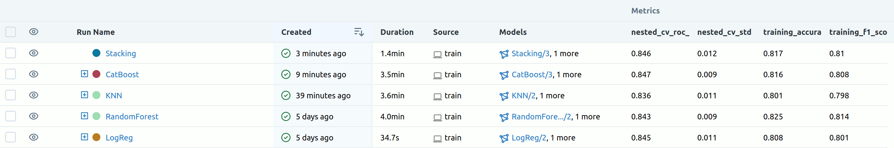
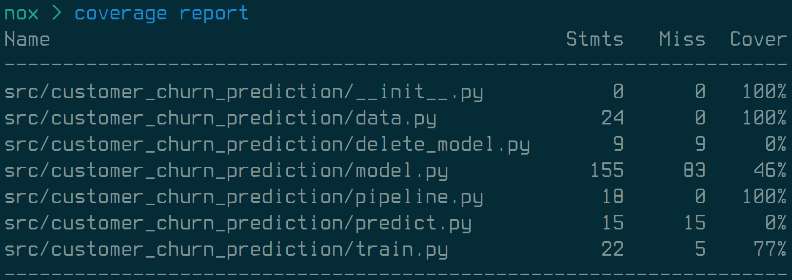

<a href="https://github.com/wervlad/customer-churn-prediction/blob/main/LICENSE">
    
</a>
<a href="https://github.com/psf/black">
    
</a>
<a href="https://github.com/wervlad/customer-churn-prediction/actions/workflows/tests.yml">
    
</a>
<a href="https://share.streamlit.io/wervlad/customer-churn-prediction/main/src/customer_churn_prediction/streamlit.py">
    
</a>

# Customer Churn Prediction

This repository contains code and resources for a machine learning competition on predicting customer churn. The competition is [hosted on Kaggle](https://www.kaggle.com/competitions/advanced-dls-spring-2021/) and the dataset includes information about customers of a telecommunications company, such as their usage patterns, account information, and demographic data.

The goal of this project is to develop a predictive model that can accurately identify which customers are at risk of churning, i.e. cancelling their service. The repository includes [exploratory data analysis](/docs/eda.ipynb), feature engineering, model selection and hyperparameter tuning, and evaluation of the model's performance on a held-out test set.

If you're interested in participating in the competition or just want to learn more about machine learning for customer churn prediction, feel free to explore the code and resources in this repository.

## Final report
Is published as Kaggle notebook: [Basic Feature Preprocessing + Stacking](https://www.kaggle.com/code/wervlad/basic-feature-preprocessing-stacking).

## Live demo
Is available [on Streamlit](https://share.streamlit.io/wervlad/customer-churn-prediction/main/src/customer_churn_prediction/streamlit.py).

## Usage

1. Clone this repository to your local machine.
2. Download the [train](https://www.kaggle.com/competitions/advanced-dls-spring-2021/data) dataset and save the CSV file locally. The default path is *data/train.csv* in the repository's root.
3. Ensure that you have Python 3.9 and [Poetry](https://python-poetry.org/docs/) installed on your machine. The author used Poetry 1.3.1.
4. Install the project dependencies using the following command:
```sh
poetry install --no-dev
```
5. To run the train script, first start mlflow server
```sh
poetry run mlflow server --host 0.0.0.0 --port 5000
```
or
```sh
make run-mlflow-server
```
if you have make installed.

Then execute the following command:
```sh
poetry run train -d <path to csv with data> -m <model>
```
Additional options can be configured via the command-line interface (CLI). To view a complete list of available options, use the help command:
```sh
poetry run train --help
```
6. To view information about the experiments you conducted, run the MLflow server by executing **one** of the following commands:
```sh
poetry run mlflow ui
```
```sh
make run-mlflow-server
```
Then, in your browser, navigate to http://localhost:5000 to see the experiments results.



## Development

To install all dependencies, including those required for development, into the Poetry environment, run the following command:
```sh
poetry install
```
Once installed, you can use developer tools such as pytest:
```sh
poetry run pytest
```
Optionally, you can install and use [nox](https://nox.thea.codes/en/stable/) to execute all testing and formatting sessions in a single command:
```sh
nox [-r]
```
In a Unix environment, you can also utilize the following commands:
```sh
make all-tests
make tests
make black
make mypy
```
To format your code using [black](https://github.com/psf/black), you can use either nox or poetry:
```sh
nox -[r]s black
poetry run black src tests noxfile.py
```

To see coverage report use
```sh
poetry run coverage report
```


There is also a shortcut in Makefile to see report in html format
```sh
make coverage-html
```
